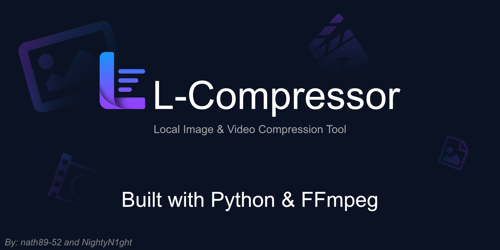
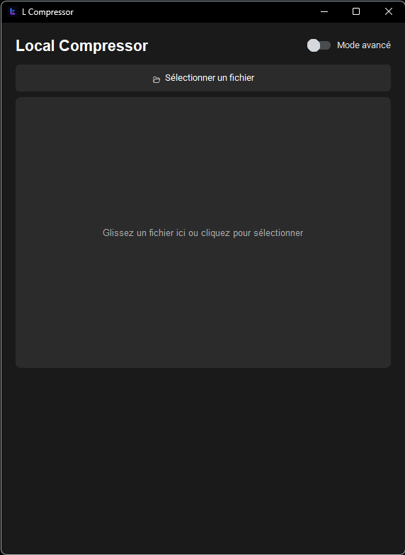
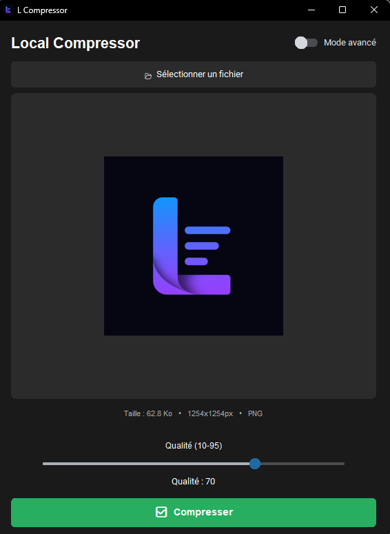
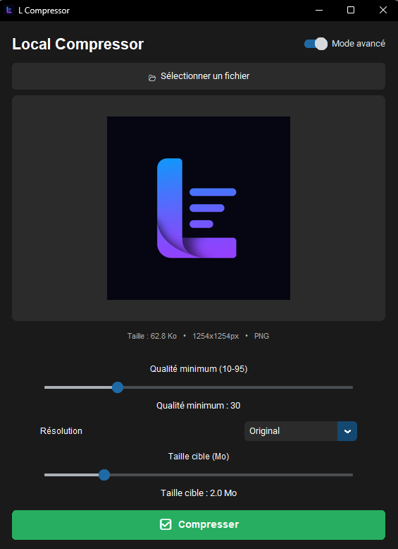
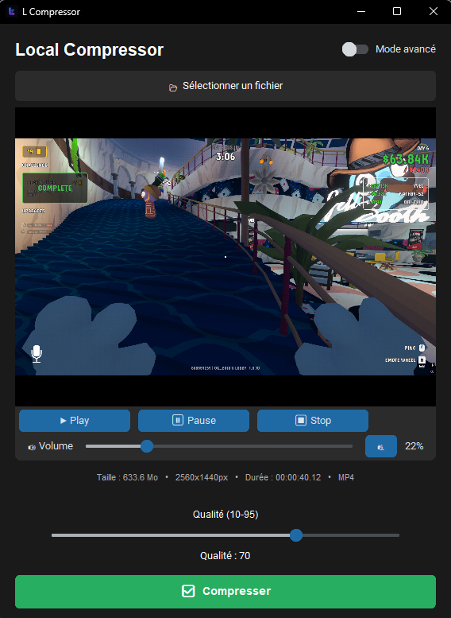

# L-Compressor

100% local image and video compression application.

<div align="center">
  
</div>

## Description

L-Compressor is a project developed in Python as part of my first year of Bac Pro CIEL.
It offers an intuitive interface with a simple mode for quick use, and an advanced mode for more precise control over compression settings.

## Features
- File selection (images and videos)
- Drag & drop support
- Image and video preview
- Built-in video playback
- Simple and advanced mode
- Image compression (quality, resolution, target size)
- Video compression with FFmpeg (CRF, bitrate, FPS, resolution)
- File information display (size, dimensions, duration, etc.)
- Double-click to edit slider values

## Preview

<div align="center">
  <table>
    <tr>
      <td align="center">
        <b>File selection</b><br/>
        
      </td>
      <td align="center">
        <b>Image compression</b><br/>
        
      </td>
      <td align="center">
        <b>Image compression (advanced)</b><br/>
        
      </td>
    </tr>
    <tr>
      <td align="center">
        <b>Video compression</b><br/>
        
      </td>
      <td align="center">
        <b>Video compression (advanced)</b><br/>
        
      </td>
      <td></td>
    </tr>
  </table>
</div>

## Technologies used

- Python
- CustomTkinter (GUI)
- FFmpeg (video processing)
- Pillow (image processing)
- tkinterdnd2 (drag & drop)
- VLC (video playback)

## Installation

### 1. Clone the project

```bash
git clone https://github.com/nath89-52/L-Compressor.git
cd L_Compressor
```

### 2. Install dependencies

```bash
pip install customtkinter pillow tkinterdnd2
```

#### Video preview (optional)

To enable video preview:

- The files `libvlc.dll`, `libvlccore.dll` and the `plugins/` folder must be in the project directory *(already included in the repo)*
- The `python-vlc` Python module:

```bash
pip install python-vlc
```

> ℹ️ Installing VLC Media Player is **not required**, the included files are sufficient.

### 3. Install FFmpeg

FFmpeg is required for this project to work.

- Download FFmpeg: https://ffmpeg.org/download.html
- Extract the archive
- Place `ffmpeg.exe` in the same folder as the script  
or add FFmpeg to the system PATH (recommended)

### 4. Run the application

```bash
python main.py
```

## Build the executable

### First build (generates the .spec file)
```bash
pyinstaller --onefile --windowed --name "L Compressor" --add-binary "ffmpeg.exe;." --add-binary "vlc/libvlc.dll;vlc" --add-binary "vlc/libvlccore.dll;vlc" --add-data "vlc/plugins;vlc/plugins" --icon=logo.ico main.py
```

### Subsequent builds using the .spec file
```bash
pyinstaller "L Compressor.spec"
```

> ⚠️ Do not re-run the first command after modifying the `.spec` file, it will overwrite it.

### Download the executable

[](https://github.com/nath89-52/L_Compressor/releases/tag/v1.0)

## Usage
- Run via terminal (`python main.py`) or launch the `.exe`
- Select a file or drag it into the window
- Choose compression settings
- Click Compress
- Choose the save location

## Available modes
### Simple mode
Quick quality adjustment

### Advanced mode
#### Images:
- Minimum quality
- Resolution
- Target size

#### Videos:
- Resolution
- FPS
- Custom bitrate

## Roadmap

- [x] Drag & Drop
- [x] Video preview
- [ ] Compression history
- [ ] Custom themes
- [ ] Size estimation before compression

## About the project

This is my first project published on GitHub.

It was developed as part of my first year of Bac Pro CIEL and allowed me to learn Python application development, the use of multimedia libraries, and the creation of graphical user interfaces.

Feedback, advice and suggestions are welcome.

## Contact

For any suggestion, advice or feedback:

You can:
- open an issue on GitHub
- propose improvements
- report bugs

## License

MIT License

Copyright (c) 2026 nath89-52

Permission is hereby granted, free of charge, to any person obtaining a copy
of this software and associated documentation files (the "Software"), to deal
in the Software without restriction, including without limitation the rights
to use, copy, modify, merge, publish, distribute, sublicense, and/or sell
copies of the Software, and to permit persons to whom the Software is
furnished to do so, subject to the following conditions:

The above copyright notice and this permission notice shall be included in all
copies or substantial portions of the Software.

THE SOFTWARE IS PROVIDED "AS IS", WITHOUT WARRANTY OF ANY KIND, EXPRESS OR
IMPLIED, INCLUDING BUT NOT LIMITED TO THE WARRANTIES OF MERCHANTABILITY,
FITNESS FOR A PARTICULAR PURPOSE AND NONINFRINGEMENT. IN NO EVENT SHALL THE
AUTHORS OR COPYRIGHT HOLDERS BE LIABLE FOR ANY CLAIM, DAMAGES OR OTHER
LIABILITY, WHETHER IN AN ACTION OF CONTRACT, TORT OR OTHERWISE, ARISING FROM,
OUT OF OR IN CONNECTION WITH THE SOFTWARE OR THE USE OR OTHER DEALINGS IN THE
SOFTWARE.
